# Bot de RPA usando WhatsApp

Bot que interactúa con WhatsApp para envío de una pauta publicitaria a un cliente. El bot toma de un excel la información del cliente, mensajes, emoticonos y una imagen para enviar

## Descripción del bot

La interacción del bot se realiza de la siguiente forma:

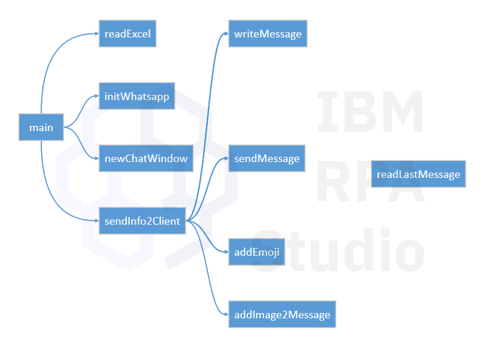

1. Se abre un excel con la información de los clientes y mensajes a enviar
2. Se genera un mensaje de saludo
3. Se adjunta una imagen
4. Se envía un mensaje de cierre

## Requisitos

Para ejecutar este bot necesitarás:

* Un IBM RPA Studio
* Una cuenta de whatsapp activa en tu móvil.

## Assets

* Script del bot: [BotWsapp.wal](bot/BotWsapp.wal)
* Archivo Excel de prueba: [ListaPautas.xlsx](asset/ListaPautas.xslsx)
* Imagen a enviar: [Pauta.png](asset/Pauta.png)

Simplemente, abre el script del bot en Studio, prepara el excel con los datos y ejecuta el bot.

## Construcción del Bot

El bot interactúa usando WhatsApp a través de su aplicación web en https://web.whatsapp.com. Para ello, trabajamos el html que se genera para utilizar los controles que ofrece la interfaz para usar el canal de comunicación tal como lo haría un ser humano.

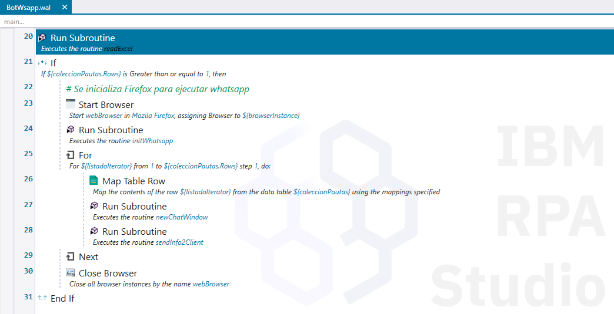

### Landing page

Al abrir la página, lo primero que tenemos que validar es si el cliente web está vinculado con la cuenta del teléfono.

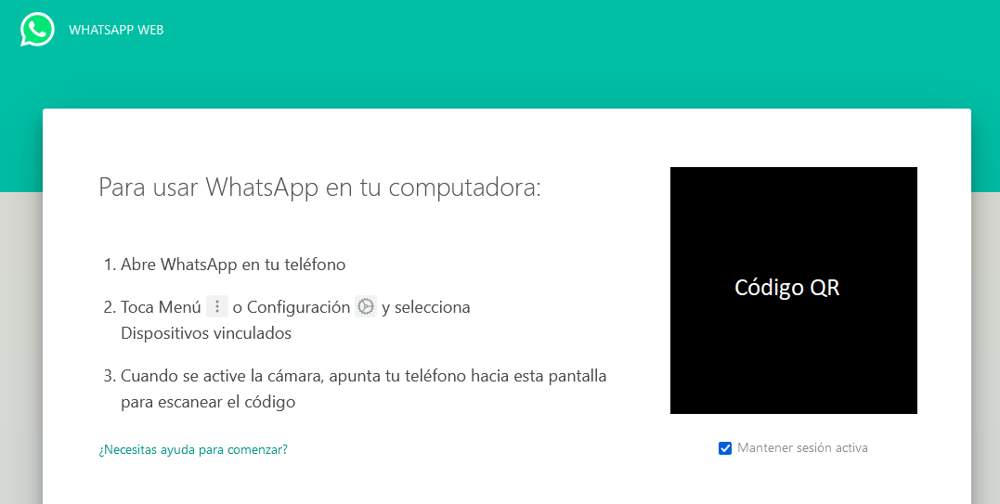

De no ser así, se nos pedirá escanear un código QR. Nuestro bot detecta la situación y espera la intervención humana para hacer la vinculación

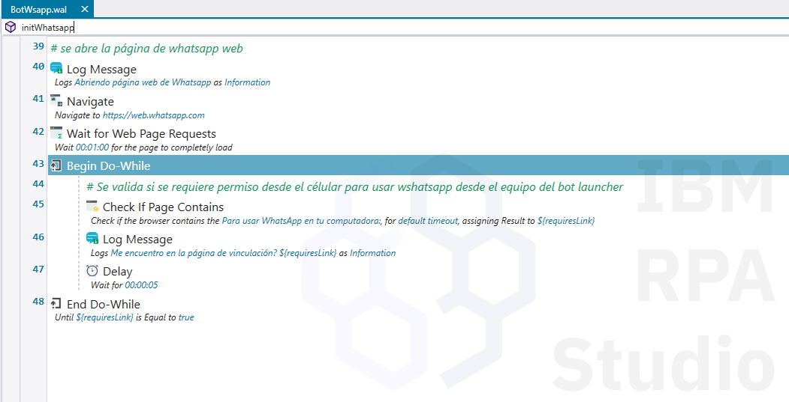

### Ventana de chat

Para iniciar el chat, usamos el número de teléfono del cliente usando este URL: https://web.whatsapp.com/send?phone=+5985555555

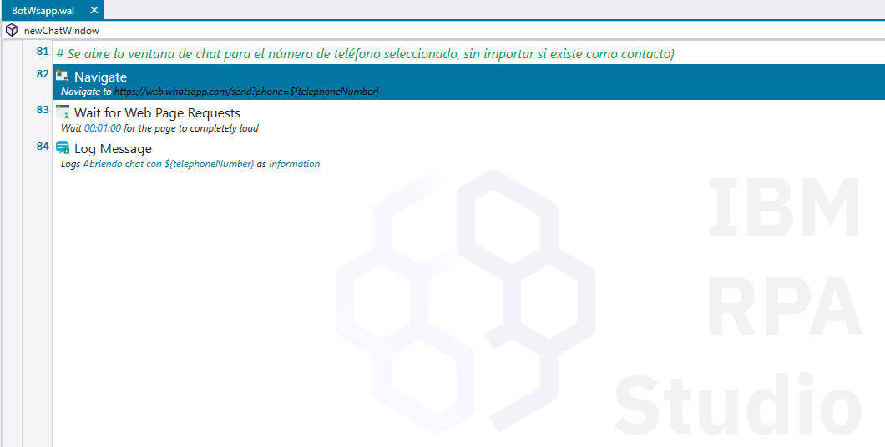

De esta forma podemos enviar mensajes a números de teléfono que no estén registrados en nuestra lista de contactos.

### Escribir mensajes

Utilizamos el grabador o buscamos directo en el html el selector del campo de entrada.

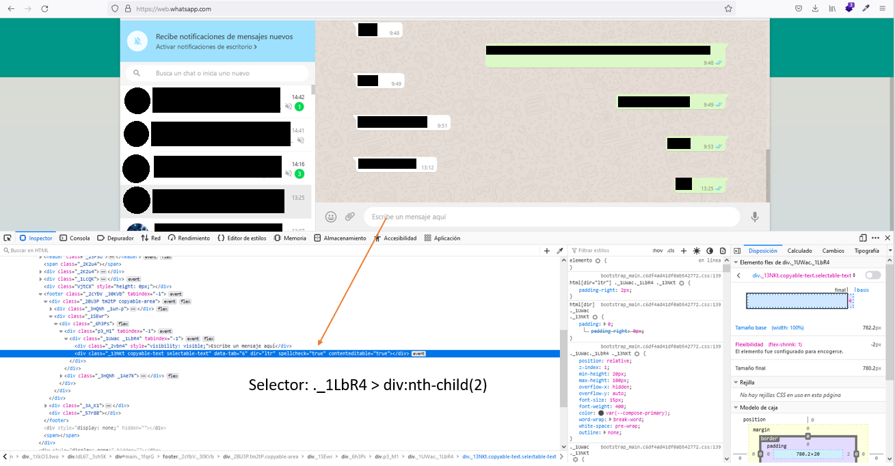

Usamos _Send Keys_ para escribir el texto que deseamos incluir

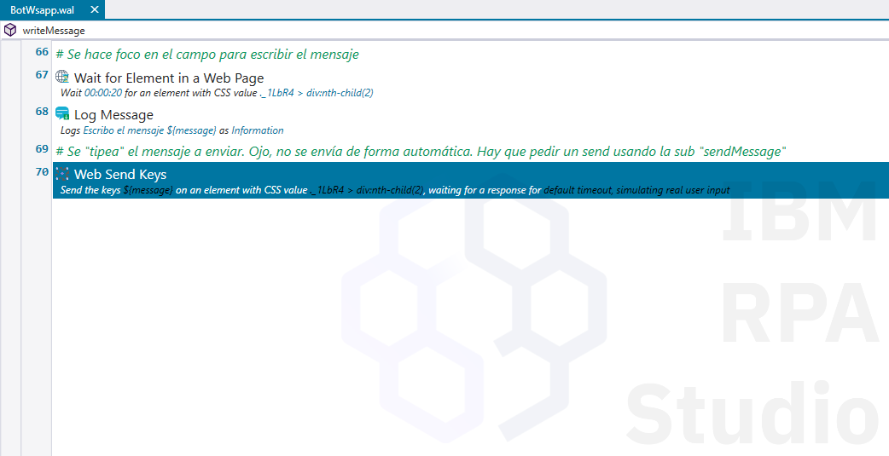

### Insertar emoticonos

Utilizamos el menú de emoticonos para insertarlos en nuestro mensaje. Para ello, nos apoyamos en la búsqueda que nos ofrece para seleccionar el primero de la lista

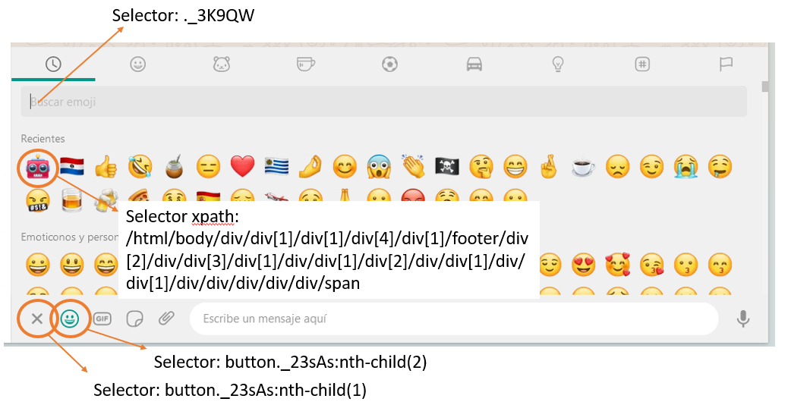

Cerramos la ventana de emoticonos para dejar la ventana de chat en su estado original.

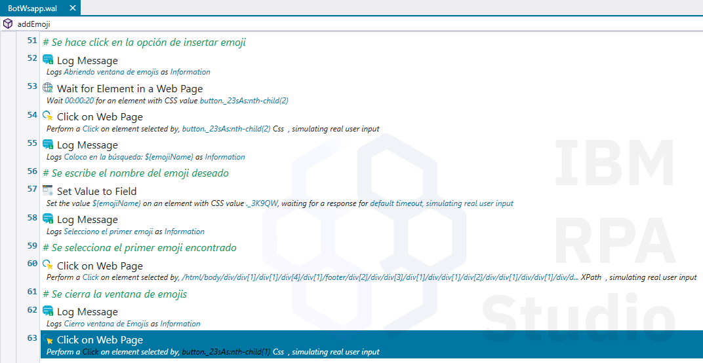

### Adjuntar imagen

Adjuntar imágenes requiere de usar controles Web y de Windows. Dado que el tipo de _input_ que se utiliza es de tipo _file_, el navegador abre una ventana para seleccionar el archivo.

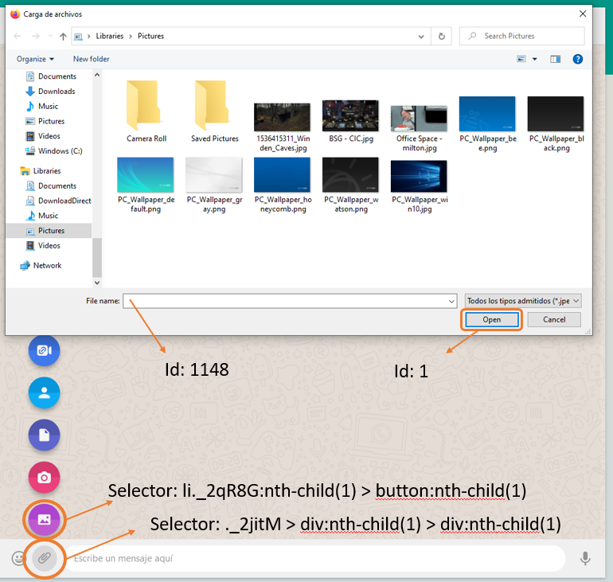

Al pulsar el botón de Aceptar en la ventana de selección de archivos, se retorna el control a la interfaz web

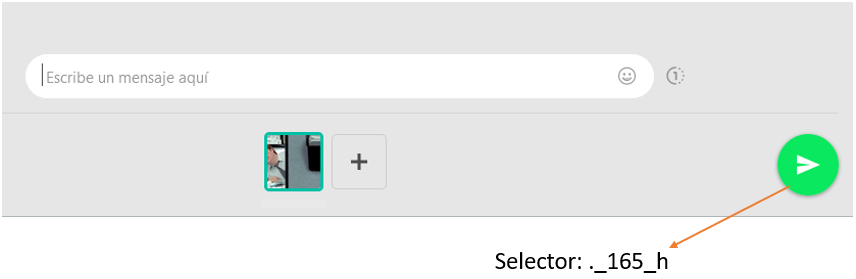

Una vez terminada la selección de la imágen, el mensaje debe enviarse para regresar la ventana de chat a su estado original

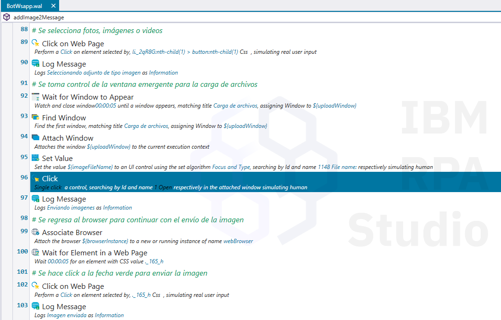

### Enviar mensaje

Finalmente, cuando un mensaje está pronto para enviar. Pulsamos el botón con la flecha

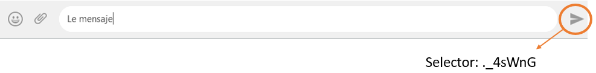

Quedando la ventana de chat pronta para seguir enviando mensajes

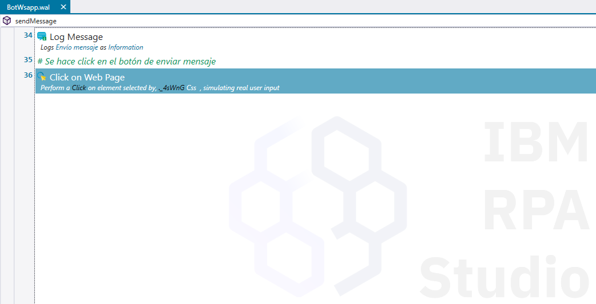

## El bot en acción

Si todo salió bien, el resultado final debe lucir así

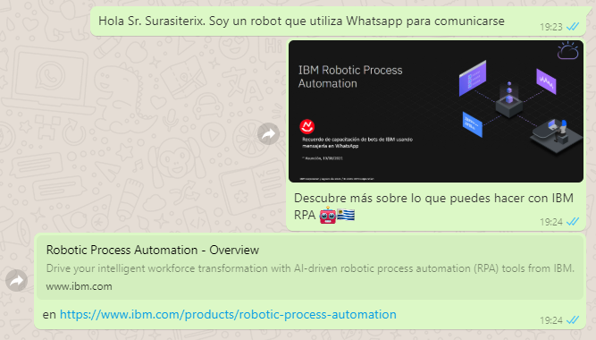

Este ejemplo usa la pauta creada para una capacitación a canales en Paraguay realizada el 19/08/2021

## Autor y reconocimientos

* Manuel Cuevas ([@surasiterix](https://github.com/surasiterix))

## Licencia

El contenido de este repositorio está licenciado siguiendo los térnimos de [Apache 2.0](https://www.apache.org/licenses/LICENSE-2.0).
